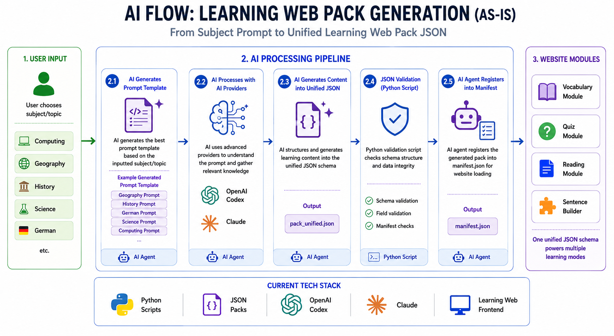

# Learning Web

Learning Web is a browser-based study app built to turn everyday learning materials into interactive revision tools.



## About This Project

This project started from a very simple personal idea:

**Can AI help parents and students turn their own study materials into interactive revision exercises automatically?**

When helping my child revise subjects like Geography, German, and History, I noticed that most revision is still very passive — reading notes repeatedly, memorising vocabulary lists, or manually creating questions.

At the same time, modern AI models are already very good at understanding educational content.

So I started building an experimental local-first learning platform called Learning Web.

The goal is not to replace teachers or schools.

The goal is to make revision more interactive, more personalised, and easier for families to create themselves.

## Why This Project Matters

Many AI education projects focus on cloud platforms, enterprise systems, or futuristic AI marketing concepts.

This project focuses on something smaller but practical:

**Helping ordinary families create their own interactive revision content using AI on their local machine.**

The long-term vision is to allow anyone — even without programming experience — to generate personalised learning activities from their own materials with minimal effort.

The project is still experimental and evolving, but it already demonstrates how AI can assist in transforming raw educational content into reusable learning experiences.

## In Progress

The platform is currently under active development, with ongoing work focused on:

- smarter AI-generated question packs
- multi-language learning support
- a growing library of game-based learning modes

## Long-Term Mission

To make personalised, high-quality learning tools accessible to every family, turning ordinary study materials into engaging digital learning experiences.

## Run locally

Install dependencies once:

```bash
npm install
```

Start the app:

```bash
npm run dev
```

Open the local URL printed by Vite, usually:

```txt
http://127.0.0.1:5173
```

## Standalone Games Hosting

Learning Web hosts exported games under `/games`. This is separate from the Learning Web `/arcade` mode.

- `/games/` — standalone games gallery
- `/games/rail-adventure/` — exported Rail Adventure game
- `/games/rail-adventure/manifest.json` — export manifest
- `/games/rail-adventure/scenes/` — exported scene JSON files
- `/games/rail-adventure/assets/` — exported static assets

Refresh Rail Adventure from the FoxChildGameEngine export:

```bash
npm run refresh:rail
```

By default, the refresh script expects the engine checkout at `./number-mage-phaser`. For another checkout:

```bash
FOXCHILD_GAME_ENGINE_DIR=/path/to/FoxChildGameEngine npm run refresh:rail
```

Verify static hosting routes:

```bash
npm run qa:games
```

## Third-Party Notices

Open-source dependencies and architectural references are recorded in [`THIRD_PARTY_NOTICES.md`](THIRD_PARTY_NOTICES.md).
